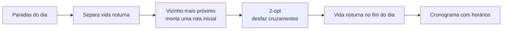

<p align="center">
    
</p>

<h1 align="center">Rover - Planejador Inteligente de Itinerários</h1>

<p align="center">
    <strong><i>Desbrave o mundo sem perder o rumo</i></strong>
</p>

<p align="center">
    Aplicação mobile que combina a precisão da <i>Teoria dos Grafos</i> com a adaptabilidade da <i>Inteligência Artificial</i> para gerar roteiros de viagem eficientes, dinâmicos e personalizados, que se adaptam ao clima e aos imprevistos da viagem.
</p>

<p align="center">
	
	
	
</p>

<p align="center">
    
    
    
    
    
    
    
    
</p>

<p align="center">
    📄 Esta é a <strong>versão 2</strong> da documentação. A versão anterior está em <a href="README_v1.md">README_v1.md</a>.
</p>

---

# 📚 Sumário

- [📖 Escopo do Projeto](#-escopo-do-projeto)
- [✨ Funcionalidades](#-funcionalidades)
- [🚀 Como Executar o Projeto](#-como-executar-o-projeto)
- [🤖 Inteligência Artificial: Llama 3.2](#-inteligência-artificial-llama-32)
- [🕸️ Otimização de Rotas com Grafos](#️-otimização-de-rotas-com-grafos)
- [🌦️ Previsão do Tempo e Alertas](#️-previsão-do-tempo-e-alertas)
- [🌐 Idiomas](#-idiomas)
- [🔐 Contas e Segurança](#-contas-e-segurança)
- [🔌 API do Backend](#-api-do-backend)
- [🏗️ Estrutura do Projeto](#️-estrutura-do-projeto)
- [🧰 Tecnologias](#-tecnologias)
- [🎨 Desenvolvimento de Marca e Design](#-desenvolvimento-de-marca-e-design)
- [💡 Ideia de Venda](#-ideia-de-venda)
- [👥 Equipe](#-equipe)

---

## 📖 Escopo do Projeto

### Problema

Planejar roteiros de viagem consome muito tempo e gera roteiros estáticos e ineficientes. Cruzar mapas e guias para descobrir a melhor ordem das atrações é frustrante, e o planejamento não resiste a imprevistos reais (como chuva ou trânsito)

### Público-Alvo

Turistas, viajantes solo, casais e famílias que buscam otimizar o tempo de suas viagens sem abrir mão da flexibilidade

### Proposta de Valor

Criação de rotas turísticas otimizadas por distância e tempo, com capacidade de recálculo dinâmico e adaptação inteligente via assistente virtual durante a viagem

## ✨ Funcionalidades

| Área | O que o app faz |
| :--- | :--- |
| **Início** | Saudação, card da **próxima viagem** (a de data mais próxima ainda não terminada), alerta de clima, atalhos e atrações da cidade por categoria. Sem viagens, mostra **sugestões de destinos** para começar |
| **Explorar** | Deck de destinos no estilo "deslize para curtir": direita para curtir, esquerda para pular, com desfazer. Detalhes do destino (nota, melhor época, orçamento, destaques) e lista de curtidos para virar roteiro com um toque |
| **Criar viagem** | Escolha do destino (curtidos aparecem primeiro) e **calendário** para escolher a data de ida e a de volta. O Rover distribui as paradas pelos dias e otimiza cada dia com grafos |
| **Roteiro** | Linha do tempo de cada dia com horário, duração, deslocamento até a próxima parada e previsão do tempo na hora da visita. Escolha do dia pelos chips no topo |
| **Edição do roteiro** | Adicionar paradas (do catálogo ou sugeridas pelo Llama), remover, reordenar, **editar o horário** de cada passeio, otimizar a rota, renomear a viagem, alterar as datas e excluir (com "desfazer") |
| **Assistente** | Chat com o Llama que conhece o roteiro e a previsão do tempo, e sugere trocas concretas em caso de chuva, trânsito ou cansaço |
| **Clima** | Previsão por hora da Open-Meteo cruzada com o roteiro, alerta de atividades ao ar livre afetadas, troca por alternativa coberta e notificação no celular |
| **Perfil** | Estatísticas, plano (Free/Premium), alertas de clima, **idioma** (português, inglês e espanhol), tema claro/escuro/sistema, assinatura e saída da conta |

### Free × Premium

| Recurso | Free | Premium |
| :--- | :---: | :---: |
| Viagens | 1 por vez | Ilimitadas |
| Duração da viagem | 1 dia (Day Trip) | Até 7 dias |
| Otimização de rota por grafos | ✅ | ✅ |
| Edição de paradas e horários | ✅ | ✅ |
| Previsão do tempo e alertas | ✅ | ✅ |
| Sugestões de lugares com o Llama | — | ✅ |
| Assistente de viagem (chat) | — | ✅ |

> A assinatura é **simulada** nesta versão do protótipo: o botão "Assinar agora" libera o Premium sem pagamento.

## 🚀 Como Executar o Projeto

### 📱 App mobile

1. **Clone** o repositório:

    ```bash
    git clone https://github.com/L-A-N-E/App-Mobile-Rover
    cd App-Mobile-Rover
    ```

2. Entre na pasta do **app** e instale as dependências:

    ```bash
    cd mobile
    npm install
    ```

3. **Rode** o aplicativo e abra no **Expo Go** (ou no navegador com `w`):

    ```bash
    npx expo start
    ```

Conta de teste: `demo@rover.com` / `Rover@2026` (há um atalho na tela de login).

O app funciona **sem o backend**: o assistente usa respostas simuladas e as sugestões com IA ficam indisponíveis.

### 🤖 Backend com a IA local

1. Instale o [Ollama](https://ollama.com) e baixe o modelo:

    ```bash
    ollama pull llama3.2:3b
    ```

2. Em outro terminal, rode a **API**:

    ```bash
    cd backend
    npm install
    npm start
    ```

3. Abra o app pelo Expo Go **na mesma rede Wi-Fi** do computador. O app descobre o IP do PC automaticamente (o mesmo usado pelo Expo). Se precisar, defina manualmente em `mobile/.env`: `EXPO_PUBLIC_API_URL=http://SEU_IP:3333`.

> No Windows, permita o Node.js no Firewall (rede privada) quando ele pedir, senão o celular não alcança a porta 3333. Com pouca memória de vídeo, feche apps pesados (emulador, Figma) para a IA responder mais rápido.

Configurações do backend (`backend/.env`, veja `backend/.env.example`):

| Variável | Padrão | Descrição |
| :--- | :--- | :--- |
| `PORT` | `3333` | Porta da API |
| `OLLAMA_URL` | `http://127.0.0.1:11434` | Endereço do Ollama |
| `OLLAMA_MODEL` | `llama3.2:3b` | Modelo usado |
| `GEOCODING` | `on` | Confere as sugestões no OpenStreetMap. Use `off` para rodar 100% offline |

## 🤖 Inteligência Artificial: Llama 3.2

O Rover usa o **Llama 3.2 3B** (`llama3.2:3b`), modelo de código aberto da Meta, rodando **localmente** no computador pelo **Ollama**. Nenhum dado da viagem é enviado para serviços de IA externos. O modelo de 3 bilhões de parâmetros cabe em GPUs de 4 GB; com mais memória de vídeo, dá para trocar por `llama3.1:8b` em `OLLAMA_MODEL`.

### Como a IA participa do roteiro

O roteiro é montado em duas camadas:

1. **Base do roteiro (grafos):** ao criar a viagem, o Rover pega os lugares do catálogo da cidade, divide entre os dias e ordena cada dia com o algoritmo de grafos (veja [Otimização de Rotas com Grafos](#️-otimização-de-rotas-com-grafos)). Isso é instantâneo e funciona offline.
2. **Personalização (Llama):** na edição do roteiro, a aba **Sugestões IA** pede ao Llama lugares **reais** que combinem com o roteiro. O modelo recebe a cidade, os lugares que já estão na viagem (para não repetir) e as categorias de interesse do viajante. Ao adicionar uma sugestão, ela entra no dia escolhido e passa pela mesma otimização de rota.

Para evitar lugares inventados, cada sugestão passa por uma checagem no backend:

* O Llama responde em **JSON estruturado** (com esquema fixo: nome, categoria, duração, se é ao ar livre e motivo), com temperatura baixa (0,4).
* O nome é conferido no **OpenStreetMap (Nominatim)**. Lugares que não existem no mapa são descartados, e a coordenada real substitui a estimativa do modelo.
* Sugestões repetidas ou a mais de 40 km do centro da cidade também são descartadas.

### Assistente de viagem

O chat envia ao Llama, como contexto, o **roteiro atual** (paradas, horários, quais são ao ar livre) e o **resumo da previsão do tempo** de cada dia. Assim o assistente sugere trocas concretas ("se chover às 15h, troque o parque pelo museu ao lado"). A resposta chega em **streaming**, palavra por palavra.

Otimizações para o modelo local responder rápido:

* **Pré-aquecimento** (`/api/chat/warmup`): quando a tela do chat abre, o contexto da viagem já é processado e fica em cache no Ollama.
* Janela de contexto fixa (2048 tokens) e modelo mantido na memória por 30 minutos entre as conversas.
* Histórico curto (últimas 8 mensagens).

O assistente e as sugestões respondem no **idioma escolhido no app**.

## 🕸️ Otimização de Rotas com Grafos

A rota de cada dia é tratada como um **grafo completo ponderado**:

* **Vértices:** as paradas do dia (cada uma com latitude e longitude reais).
* **Arestas:** ligam todos os pares de paradas.
* **Pesos:** a distância real entre as paradas, calculada pela **fórmula de Haversine** (distância sobre a superfície da Terra).

Encontrar a ordem que percorre todas as paradas com a menor distância é o **Problema do Caixeiro-Viajante (TSP)**. O Rover resolve em duas etapas (`mobile/src/utils/route.ts`):



1. **Vizinho mais próximo:** começando pela primeira parada, vai sempre para a parada ainda não visitada mais próxima. Gera rapidamente uma boa rota inicial.
2. **Melhoria 2-opt:** testa inverter trechos da rota. Sempre que a inversão diminui a distância total (o que elimina "cruzamentos" no caminho), ela é aplicada, até não haver mais ganho.
3. **Regra de vida noturna:** bares e casas noturnas ficam sempre no fim do dia, otimizados a partir da última parada diurna.

**Distribuição em vários dias:** ao criar uma viagem de vários dias, todos os lugares são ordenados uma vez, divididos em blocos iguais (um por dia) e cada dia é otimizado de novo.

**Cronograma:** o dia começa às **09:00**. Cada parada soma seu tempo médio de visita e o deslocamento até a próxima, estimado a uma velocidade média urbana de 14 km/h (entre caminhada e transporte público), com mínimo de 5 minutos.

**Na tela do roteiro:**

* Mostra paradas, distância total e duração do dia.
* Se a ordem atual não é a melhor, aparece **"Rota pode ficar X km menor"** com o botão **Otimizar**. Quando já está na melhor ordem, o app avisa.
* O usuário pode **fixar o horário** de qualquer passeio. As paradas seguintes se ajustam a partir dele, e o app avisa se o horário escolhido não dá tempo de chegar vindo da parada anterior. O botão "Automático" volta ao cálculo padrão.

## 🌦️ Previsão do Tempo e Alertas

O app consulta a [Open-Meteo](https://open-meteo.com) (gratuita, sem chave de API) com as coordenadas da cidade e as datas da viagem. A previsão vem **por hora**, no fuso da cidade, e cobre até 16 dias (cache de 30 minutos).

A previsão é cruzada com o roteiro (`mobile/src/utils/weatherImpact.ts`). Só **atividades ao ar livre** são afetadas, e o app olha as horas exatas da visita:

| Condição | Critério |
| :--- | :--- |
| Tempestade | Código de tempestade da previsão |
| Neve | Códigos de neve |
| Chuva | Probabilidade ≥ 50% ou ≥ 0,5 mm na hora |
| Ventos fortes | ≥ 45 km/h |
| Calor extremo | ≥ 35 °C |
| Frio intenso | ≤ 0 °C |

Quando uma atividade é afetada:

* O card do clima e a parada ficam destacados, com o motivo ("Chuva 80% às 15h").
* O app sugere uma **alternativa coberta** próxima que ainda não está no roteiro (prioriza cultura e gastronomia) e troca com um toque, com opção de desfazer. Se a parada tinha horário fixo, a alternativa herda o horário.
* A Home mostra um alerta de que o clima pode afetar a viagem.
* O Rover envia uma **notificação local** avisando que a programação precisa ser alterada, uma vez por dia afetado. Tocar na notificação abre a viagem. Onde o sistema não permite notificações (Expo Go no Android e web), o aviso aparece dentro do app.

A checagem roda ao abrir o app, ao voltar para ele (no máximo a cada 30 minutos) e sempre que o roteiro, as datas ou os horários mudam. Os alertas podem ser desligados em **Perfil → Alertas de clima**.

> Para viagens a mais de ~14 dias, o app informa a partir de quando a previsão fica disponível.

## 🌐 Idiomas

O app está disponível em **português (BR)**, **inglês** e **espanhol**. A troca é feita em **Perfil → Idioma** (ou pelo botão `PT/EN/ES` na tela inicial, antes do login) e muda todo o conteúdo na hora, sem reiniciar:

* Textos das telas, botões, avisos, mensagens de erro e de validação.
* Catálogo: nomes de destinos e países, descrições, tags, melhor época e nomes dos lugares.
* Datas (meses, dias da semana e formato "19 Out" / "Oct 19"), números decimais, previsão do tempo, alertas e notificações.
* Respostas do assistente e motivos das sugestões do Llama.

Na primeira abertura, o app usa o idioma do celular; a escolha fica salva no aparelho.

**Para desenvolvedores:** os textos ficam em `mobile/src/i18n/` (`pt.ts` é a base; `en.ts` e `es.ts` são tipados a partir dela, então uma tradução faltando vira erro de compilação). Nas telas, use `const { t, tn } = useI18n()`:

```tsx
t('detail.timeChanged', { time: '14:30' }); // "Horário alterado para 14:30"
tn('unit.stop', 3);                          // "3 paradas" (plural com chaves _one/_other)
```

As traduções do catálogo ficam em `mobile/src/data/catalogI18n.ts`.

## 🔐 Contas e Segurança

Nesta versão, o login é **local** (salvo no aparelho), enquanto o backend não tem autenticação:

* Senhas guardadas como **hash SHA-256 com salt** aleatório por usuário, nunca em texto puro.
* Regras de senha forte (8+ caracteres, maiúscula, minúscula, número e símbolo), bloqueio de senhas comuns e de senhas que contêm o nome ou o email, com medidor de força.
* **Bloqueio de 60 s após 5 tentativas** erradas, com mensagem genérica que não revela se o email existe.
* Sugestão de correção de email digitado errado ("Você quis dizer gmail.com?").
* Cada conta tem suas próprias viagens e destinos curtidos. Toda conta nova começa **sem viagens**, com sugestões de destinos.

## 🔌 API do Backend

| Endpoint | Descrição |
| :--- | :--- |
| `GET /api/health` | Status do Ollama e do modelo |
| `POST /api/chat` | Chat com streaming (NDJSON), usando o roteiro e o clima como contexto |
| `POST /api/chat/warmup` | Pré-carrega o contexto da viagem para a 1ª resposta ser rápida |
| `POST /api/suggestions` | Sugestões de lugares reais, conferidas no OpenStreetMap |

Exemplo de pedido de sugestões:

```json
{
  "city": { "name": "Lisboa", "country": "Portugal", "lat": 38.71, "lng": -9.15 },
  "existing": ["Torre de Belém", "Castelo de São Jorge"],
  "interests": ["Cultura", "Gastronomia"],
  "language": "pt",
  "count": 4
}
```

O campo `language` (`pt`, `en` ou `es`) define o idioma das respostas; no chat ele vai dentro de `context`.

## 🏗️ Estrutura do Projeto

```
App-Mobile-Rover/
├── mobile/                      # App (React Native + Expo)
│   ├── App.tsx                  # Providers: idioma, tema, toasts, conta, viagens
│   └── src/
│       ├── components/          # Botões, cards, calendário, seletor de horário, deck de destinos...
│       ├── contexts/            # Auth, Trips, Theme, Language, Toast
│       ├── data/                # Catálogo de destinos/lugares e traduções do catálogo
│       ├── hooks/               # Previsão da viagem, status da IA
│       ├── i18n/                # Traduções (pt, en, es)
│       ├── navigation/          # Pilhas, abas e barra de navegação animada
│       ├── screens/             # Início, Explorar, Viagens, Roteiro, Assistente, Perfil, Premium, login
│       ├── services/            # API da IA, Open-Meteo, notificações
│       ├── tokens/              # Cores (claro/escuro), tipografia, espaçamentos
│       └── utils/               # Grafos e rotas, datas, impacto do clima, validação
│
└── backend/                     # API Node/Express + Llama (Ollama)
    └── src/
        ├── routes/              # /api/chat e /api/suggestions
        ├── prompts.ts           # Instruções enviadas ao modelo
        ├── ollama.ts            # Cliente do Ollama
        ├── geocode.ts           # Coordenadas reais (OpenStreetMap)
        └── validation.ts        # Validação dos pedidos
```

## 🧰 Tecnologias

| Camada | Tecnologias |
| :--- | :--- |
| App | React Native 0.86, Expo SDK 57, TypeScript, React Navigation 7, AsyncStorage, expo-notifications, expo-crypto, expo-haptics |
| IA | Llama 3.2 3B (Meta) via Ollama |
| Backend | Node.js, Express 5, TypeScript (tsx) |
| Dados externos | Open-Meteo (previsão do tempo), OpenStreetMap Nominatim (coordenadas) |
| Algoritmos | Grafo completo ponderado (Haversine), vizinho mais próximo + 2-opt |

## 🎨 Desenvolvimento de Marca e Design

### Identidade Visual e Logo

* **Nome**: Rover (Remete à exploração, descoberta e movimentação eficiente)

* **Logo Conceitual**:
  

### Paleta de Cores e Tipografia


### Telas Conceituais


<!--  -->

O app tem **tema claro e escuro** (ou segue o sistema) e usa a fonte **Archivo**.

## 💡 Ideia de Venda

### Modelo de Negócio

O **Rover** opera num modelo **Freemium**:

* **Versão Free**: 1 viagem por vez, de 1 dia (Day Trip), com rota otimizada pelo algoritmo de grafos, edição de paradas e horários e alertas de clima.

* **Versão Premium (Assinatura de R$ 19,90/mês)**: viagens ilimitadas de até 7 dias, sugestões de lugares pelo Llama e o Assistente contextual para alterações dinâmicas no meio da viagem.

### Diferencial Competitivo

O grande diferencial do **Rover** é a sua capacidade de adaptação em tempo real. Em vez de entregar um planejamento estático que perde a utilidade diante de imprevistos, o **Rover cria, otimiza e recalcula o itinerário completo de forma dinâmica**. Se a previsão indicar chuva no meio da tarde, por exemplo, o app avisa, sugere um local coberto próximo, faz a troca no roteiro e recalcula a rota; o Assistente contextual ajuda com qualquer outro imprevisto.

## 👥 Equipe

| Nome | RM | Papel |
| :--- | :--- | :--- |
| **Alice Santos Bulhões** | `RM554499` | **Product Owner (PO)** (Escopo, Documentação e Priorização) |
| **Eduardo Oliveira Cardoso Madid** | `RM556349` | **Backend** (API, Cybersegurança, Documentação da API) |
| **Nicolas Haubricht Hainfellner** | `RM556259` | **Desenvolvedor Frontend** (React Native, Expo, Navegação) |
| **Guilherme da Cunha Melo** | `RM555310` | **UI/UX Designer** (Identidade visual, prototipação no Figma) |
| **Matheus Gushi Morioka** | `RM556935` | **Quality Assurance (QA)** (Testes, validação de fluxo e revisão) |
